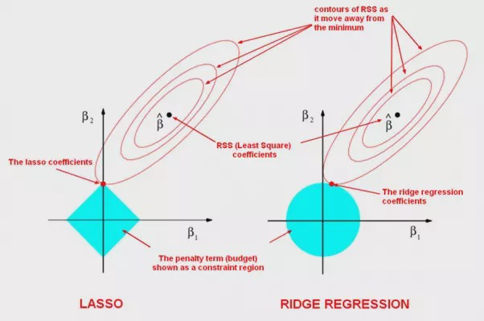

# 📘 Ridge Regression

---

## 📌 Key Concepts

1. **Ridge Regression is also known as Tikhonov Regularization.**
2. The penalty (regularization) term is **only applied during training**, not during testing or validation.
3. Regularization helps in:
   - Controlling **overfitting** (high variance)
   - Handling **multicollinearity**  
     - When a predictor variable in a multiple regression model can be linearly predicted from the others

---

## ✅ Advantages of Ridge Regression

- Handles **overfitting** by penalizing large weights.
- Addresses **multicollinearity** effectively.
- Retains all variables, which is useful when every feature is somewhat informative.

---

## ❌ Disadvantages of Ridge Regression

- **Does not perform feature selection** — all features remain in the model, even if some are redundant or less impactful.
- Can introduce **bias** by shrinking coefficient values towards zero.

---

## 🧮 Cost Function

The regularized cost function in Ridge Regression is:

```text
J(w, b) = (1 / 2m) * Σᵐᵢ=₁ [f₍w,b₎(x⁽ⁱ⁾) - y⁽ⁱ⁾]² + (λ / 2m) * Σⁿⱼ=₁wⱼ²
```                                                               

Where:
- `m`: Number of training examples  
- `n`: Number of features (coefficients)  
- `λ`: Regularization parameter (also denoted as `α`)  
- `wⱼ`: Weight/parameter for feature `j`

---

## 📏 Regularization Term

This is equivalent to the **squared L2 norm**:

```text
Regularization Term = (λ / 2m) * ||w||² = (λ / 2m) * Σⁿⱼ=₁ wⱼ²
```

---

## 🔍 Mathematical Intuition

Ridge Regression adds a constraint on the size of the weight vector `w`:

```text
Σⁿⱼ=₁ wⱼ² ≤ t
```

### Geometrically:


- In 2D:

  ```text
  w₁² + w₂² ≤ t
  ```

- In higher dimensions, this becomes a **hypersphere**.

- The threshold `t` is a function of `λ`:  
  **Larger λ → smaller t → stronger regularization**

---

## 🧭 Visual Intuition: Loss Surface & Constraint

- The **squared loss** `(yᵢ - ŷᵢ)²` forms **elliptical contour curves** in `w`-space (weight space).
- The **regularization constraint** `||w||² ≤ t` defines a **circular region** centered at the origin.

**Optimization Interpretation:**

1. Imagine sliding the ellipse (loss contour) toward the origin to minimize the loss.
2. The **moment this ellipse first touches the constraint region**, that point is the **optimal `w`**.

---

## 📝 Summary

- Ridge regression is ideal when we want to **retain all features** but avoid overfitting.
- It **shrinks coefficients** rather than eliminating them.
- Useful in high-dimensional data and scenarios with **multicollinearity**.

---

