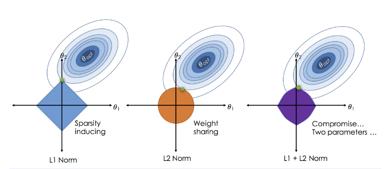

## Lasso Regression

This document provides a clear and comprehensive explanation of Lasso Regression, a powerful regularization technique in statistics and machine learning.

## Table of Contents

1. [Introduction](#introduction)
2. [The Core Concepts](#the-core-concepts)

   * [Key Concepts](#key-concepts)
   * [Advantages of Lasso Regression](#advantages-of-lasso-regression)
   * [Disadvantages of Lasso Regression](#disadvantages-of-lasso-regression)
3. [Cost Function](#cost-function)
4. [Regularization Term](#regularization-term)
5. [Mathematical Intuition](#mathematical-intuition)
6. [Visual Intuition: Loss Surface & Constraint](#visual-intuition-loss-surface--constraint)
7. [Summary](#summary)
8. [How to Use This Repository](#how-to-use-this-repository)
9. [Contributing](#contributing)
10. [License](#license)

---

## Introduction

Lasso Regression (Least Absolute Shrinkage and Selection Operator Regression) is a linear model that incorporates L1 regularization. It is widely used to enhance model generalization by penalizing large coefficients and performing feature selection.

## The Core Concepts

### Key Concepts

1. **Lasso Regression**

   * Full form: **Least Absolute Shrinkage and Selection Operator Regression**
   * Uses the **L1 norm** of the parameter vector as the penalty.
   * Regularization constraint is **diamond-shaped** (in 2D).
   * Encourages **sparsity** — setting some parameters exactly to zero.

### Advantages of Lasso Regression

* Performs **feature selection** automatically.
* Produces a **sparse model** — only important variables remain.
* Reduces **overfitting** effectively.
* Works well when **few variables are truly relevant**.

### Disadvantages of Lasso Regression

* Introduces **bias** by shrinking coefficients.
* When features are **correlated**, Lasso tends to:

  * Pick **only one feature** from the group.
  * Randomly **ignore the others**, leading to instability.
* Not suitable when:

  * **All features are important**
  * **Group selection** is desired

## Cost Function

The regularized cost function in Lasso Regression is:

```text
J(θ) = (1 / 2m) * Σᵐᵢ=₁ [f_θ(x⁽ⁱ⁾) - y⁽ⁱ⁾]² + (λ / 2m) * Σⁿⱼ=₁ |θⱼ|
```

Where:

* `m`: Number of training examples
* `n`: Number of features (parameters)
* `λ`: Regularization parameter
* `θ₀`: Intercept term
* `θⱼ`: Parameter for feature `j`

Here, the hypothesis function is:

```text
f_θ(x) = θ₀ + Σⁿⱼ=₁ θⱼ xⱼ
```

## Regularization Term

This is equivalent to the **L1 norm**:

```text
Regularization Term = (λ / 2m) * ||θ||₁ = (λ / 2m) * Σⁿⱼ=₁ |θⱼ|
```

## Mathematical Intuition


Lasso Regression adds a constraint on the size of the parameter vector `θ`:

```text
Σⁿⱼ=₁ |θⱼ| ≤ t
```

**Geometrically:**


* In 2D:

  ```text
  |θ₁| + |θ₂| ≤ t
  ```

* In higher dimensions, this becomes a **cross-polytope**.

* The threshold `t` is a function of `λ`:
  **Larger λ → smaller t → stronger regularization**

## Visual Intuition: Loss Surface & Constraint

* The **squared loss** `(yᵢ - ŷᵢ)²` forms **elliptical contour curves** in `θ`-space (parameter space).
* The **regularization constraint** `||θ||₁ ≤ t` defines a **diamond-shaped region** centered at the origin.

**Optimization Interpretation:**

1. Imagine sliding the ellipse (loss contour) toward the origin to minimize the loss.
2. The **first point of contact** between the ellipse and the constraint region is the **optimal `θ`**.
3. Since the diamond has sharp corners, the ellipses often touch at these **corners**, resulting in **exact zeros in some `θⱼ`**.

```text
⇒ Sparse solution
```

## Summary

* Lasso regression is ideal when we want a **simplified model** with **automatic feature elimination**.
* It **shrinks coefficients**, often to **exact zero** for some parameters.
* Useful when **only a few features are important**.
* For correlated or grouped features, consider using **Elastic Net** instead.

## How to Use This Repository

This repository is primarily for educational purposes.

* **Read this `README.md` file** to understand the theoretical concepts.
* **Explore the Jupyter Notebook** (`lasso_regression_demo.ipynb`) for a practical implementation.

## Contributing

Contributions are welcome! If you find any errors, typos, or have suggestions for improvement, please:

1. Fork the repository.
2. Create a new branch (`git checkout -b feature/your-feature-name`).
3. Make your changes.
4. Commit your changes (`git commit -m 'Add some feature'`).
5. Push to the branch (`git push origin feature/your-feature-name`).
6. Open a Pull Request.

## License

This project is licensed under the MIT License. See the `LICENSE` file for details.
